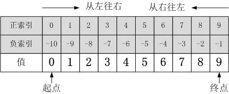

# 1.6数据结构之字符串

在python中，我们用input函数输入的数据都是字符串类型的，所以字符串是数据类型中最为重要的一类。

### 认识字符串

Python中一般使用引号来创建字符串，其实使用三引号也可以创建字符串。

```python
# 1.1单引号创建字符串
a='I am waldeincheng'
print(a)
print(type(a))
# 1.2双引号创建字符串
b="I am waldeincheng"
print(b)
print(type(b))
# 1.3三引号创建字符串
c='''I am waldeincheng'''
print(c)
print(type(c))
d="""I am waldeincheng"""
print(d)
print(type(d))
```

三引号跟多行注释的用法差不多，区别为，单引号换行时会有一个反斜杠，输出时还是单行输出，三引号可以直接换行书写，输出会按照书写方式输出。

```python
e='I am ' \
  'waldeincheng'
print(e)
f='''I am 
waldeincheng'''
print(f)
# 输入结果为
I am waldeincheng
I am 
waldeincheng
```

### 字符串输入输出

输出输出在1.3格式化输出里都详细记录了。

### 下标

`下标`又叫`索引`，作用是通过下标快速找到对应的数据，下标是从0开始的，变量名[下标值]。

```python
str='abcdef'
print(str[0])
print(str[1])
```

### 切片

`切片`是对操作的对象截取一部分的操作。使用语法如下：

```python
序列名[开始下标:结束下标:步长]
```



​	注：图中正索引，副索引也就是步长的的正负。

- 开始下标和结束下标选取的范围为**左闭右开区间**，也就是结束下标所在的那个元素不选取，正负都行
- 步长为选取间隔，正负都行，默认为1
- 开始下标为空，表示从开头开始选取，结束下标为空，表示选取到最后，步长为空，表示默认为1
- 步长为负数，表示从后往前选取
- 开始下标为-1，表示最后一个元素，依次往前为-2，-3等等

```python
'''
字符串进阶知识点练习
1.切片的使用：`切片`是对操作的对象截取一部分的操作。使用语法如下：
序列名[开始下标:结束下标:步长]
'''
str='0123456789'
print(str[2:5:1])	# 输出234，从2到5，左开右闭，间隔为1
print(str[2:5:2])	# 输出24，从2到5，左开右闭，间隔为2
print(str[2:5])	# 输出234，从2到5，左开右闭，间隔默认为1
print(str[:5:1])	# 输出01234，开始下标为空，默认从头开始
print(str[2::1])	# 输出23456789，结束下标为空，默认到尾
print(str[2:5:-1])	# 输出为空，从2到5为从左到右方向，步长为负，方向为从右到左，方向冲突
print(str[-2:-5:1])	# 输出为空，从-2到-5为从右到左方向，步长为正，方向为从左到右，方向冲突
print(str[-2:-5:-1])	# 输出876，从-2到-5为从右到左方向，步长为负，方向为从右到左	
```

### 字符串常用方法

字符串常用方法分为查找、修改和判断三大类，其中修改功能最为常用。

#### 查找

常用方法有三个，语法结构为：

```python
字符串序列.find(子串，开始下标位置，结束下标位置)
字符串序列.index(子串，开始下标位置，结束下标位置)
字符串序列.count(子串，开始下标位置，结束下标位置)
```

- 语法逻辑是在开始下标和结束下标之间，查找子串
- **find()**是查找是否存在子串，存在返回**子串开始位置**的下标，不存在返回-1
- **index()**也是查找是否存在子串，存在返回**子串开始位置**的下标，不存在会报错
- **count()**是查找子串出现的次数，返回出现的次数，不存在返回为0

#### 修改

**replace():替换**

```python
字符串序列.replace(旧子串，新子串，替换次数)
```

- 替换次数为空，默认就是替换所有出现的旧子串
- replace()函数有返回值，会返回一个替换后的字符串，原字符串没有改变

```python
str='I am a good boy'
new_str=str.replace('good','bad')
print(new_str) # I am a bad boy
```

**split():分割**

```python
字符串序列.split(分割符，替换次数)
```

- 以分隔符为界限分割成一个列表，分隔符会丢失
- 分隔符为空，默认按空格分割

```python
str2='I am a good boy and I like Python'
print(str2.split()) # ['I', 'am', 'a', 'good', 'boy', 'and', 'I', 'like', 'Python']
print(str2.split('I')) # ['', ' am a good boy and ', ' like Python']
print(str2.split('I',1)) # ['', ' am a good boy and I like Python']
```

**join():连接**

```python
字符或子串.join(多字符串组成的序列)
```

```python
list=['python','books','movie','music']
newlist=' and '.join(list)
print(newlist) # python and books and movie and music
```

其他常用方法如下：

- capitalize()：将字符串的第一个字符转换为大写
- title()：将字符串的每一个单词的首字母大写
- lower()：将字符串中大写转小写
- upper()：将字符串中小写转大写
- lstrip()：删除字符串左侧空白字符
- rstrip()：删除字符串右侧空白字符
- strip()：删除字符串两个空白字符

#### 判断

判断即是判断真假，返回值为布尔型数据类型：True或False。

**startswith()**：判断是否以某个子串开始，是返回为True，不是返回为False，也可以以某个区间为界限，判断在特定区间内是否以某个子串开始

```python
字符串序列.startswith(子串，开始下标位置，结束下标位置)
```

**endswith()**：判断是否以某个子串结束，是返回为True，不是返回为False，也可以以某个区间为界限，判断在特定区间内是否以某个子串结束

```python
字符串序列.endswith(子串，开始下标位置，结束下标位置)
```

```python
# 1.startswith()
str3='Life is short,I love Python'
print(str3.startswith('Life'))
print(str3.startswith('Lifs'))

# 2.endswith()
print(str3.endswith('Python'))
print(str3.endswith('Pythos'))
```

其他常用方法：

- isalpha()：判断是否都是字母组成
- isdigit()：判断是否都是数字组成
- isalnum()：判断是否是字母或者数字或者两者结合组成的 
- isspace()：判断是否空白