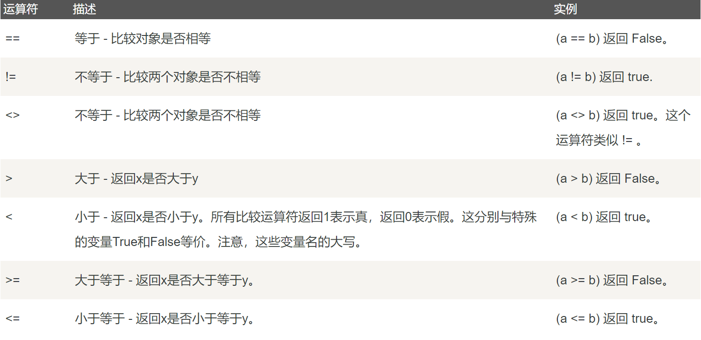
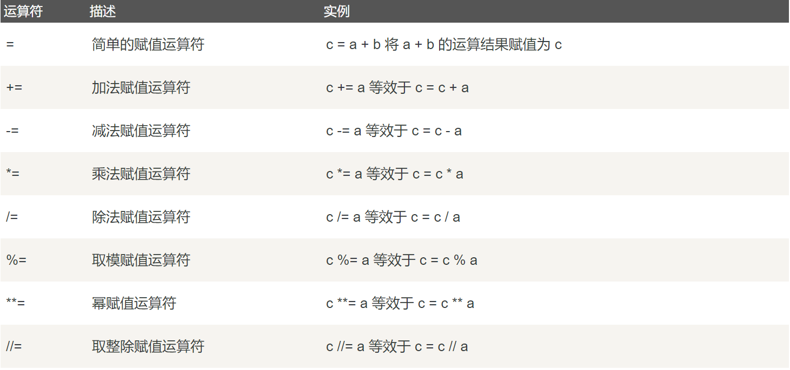
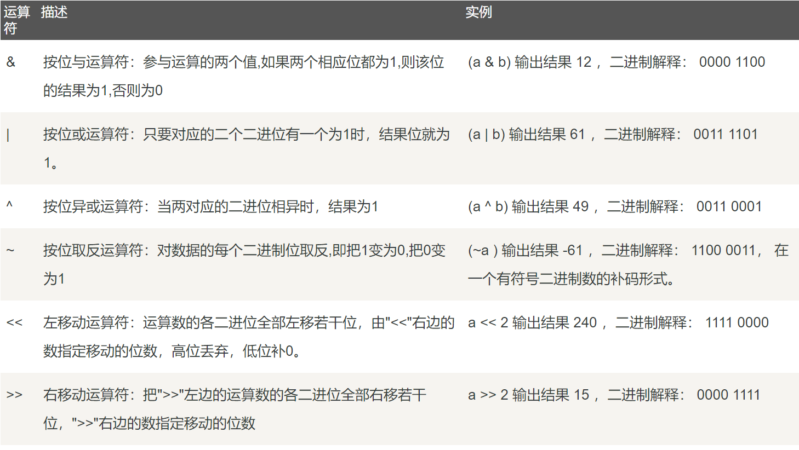
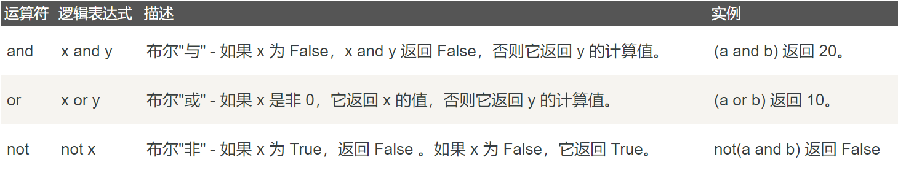
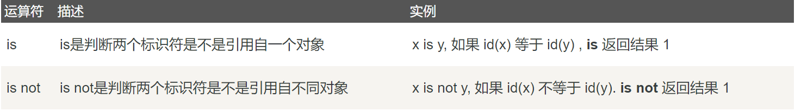
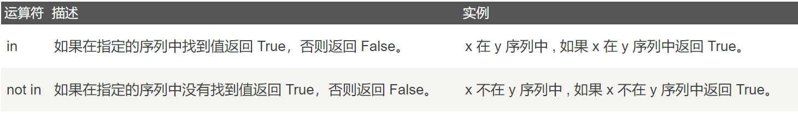

# [补充篇]Python运算符

### 算术运算符

**假设a=10,b=20**


### 关系运算符

关系运算符，又叫比较运算符，返回布尔值，True或False。

**假设a=10,b=20**



### 赋值运算符

**假设a=10,b=20**



### 位运算符

按位运算符是把数字看作二进制来进行计算的。

假设变量 a 为 60，b 为 13，a和b的二进制如下：

```bash
a = 0011 1100
b = 0000 1101
```

运算规则如下：



### 逻辑运算符

**假设a=10,b=20**



### 身份运算符和成员运算符

此外还有**`身份运算符`**和**`成员运算符`**,具体表述如下图：



